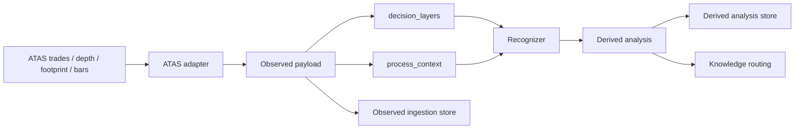

# Process-Aware Multi-Time-Cycle Architecture

## Goal

Build a market structure system that can preserve both:

- static snapshot context across month, week, day, hour, and minute layers
- dynamic formation process across seconds, liquidity episodes, and cross-session sequences

The system should always separate `observed facts` from `derived interpretation`.

## Layer Model

### Observed layers

- `macro_context`
  - month / week / day
  - structural range, key liquidity references, value area, swing structure
- `intraday_bias`
  - last 3 days / 1h / 30m
  - session positioning, directional pressure, intraday context
- `setup_context`
  - 15m / 5m
  - setup location, local pullback depth, local imbalance
- `execution_context`
  - 1m / footprint / DOM
  - immediate order-flow and execution signals
- `process_context`
  - `session_windows`: Asia / Europe / U.S. session windows
  - `second_features`: 1-second heatmap and price-path aggregates
  - `liquidity_episodes`: measured defended or contested price bands
  - `cross_session_sequences`: multi-session build, hold, and release traces
- `depth_elastic_context`
  - `depth coverage state`: unavailable / bootstrap / live / interrupted
  - `significant large-order tracks`: only high-impact displayed liquidity
  - `3-day liquidity memory`: spoof, absorption, magnet, defended-level candidates

### Derived layers

- `macro_context` interpretations
- `intraday_bias` interpretations
- `setup_context` interpretations
- `execution_context` interpretations
- `process_context` interpretations
  - cross-session release candidate
  - persistent defended zone
  - process divergence between higher build and lower execution

## Data Flow

## Why The Process Layer Exists

Snapshot-only systems miss:

- how price traversed the bar
- whether liquidity was replenished or pulled
- whether a defended zone persisted across one session and released in another
- whether a 1-minute base is part of a larger cross-session build-up
- whether a large displayed order was pulled before execution or truly traded
- whether a historically significant order level still matters on revisit within the next few days

The `process_context` layer exists to preserve these facts in a replayable form before strategy logic is added.

## Observed Objects

### `ObservedSecondFeature`

Stores second-level aggregates such as:

- price path inside the second
- trade count, volume, delta
- best bid/ask
- depth imbalance
- extra measured metrics like absorption score or sweep distance

### `ObservedLiquidityEpisode`

Stores measured interaction with a price band:

- zone bounds
- executed volume against the zone
- replenishment count
- pull count
- rejection distance

This is still observational. The system should not directly label it as accumulation or distribution at ingest time.

### `ObservedCrossSessionSequence`

Stores multi-session continuity:

- which sessions participated
- maintained zone
- start price and latest price
- linked episode ids and event ids

This allows the system to later infer narratives like Europe build and U.S. release without losing the underlying evidence.

### `DepthSnapshotPayload`

Stores elastic depth coverage facts:

- current coverage state
- significant large-order tracks only
- best bid and ask reference
- track lifecycle status such as active, pulled, filled, or moved

This payload is intentionally sparse so the system does not need to store the full order book.

### `LiquidityMemoryRecord`

Stores only high-value depth memory for up to 3 days:

- significant order track summary
- derived classification such as spoof candidate or absorption candidate
- expiration time

This memory is designed for short-term manipulation and revisit behavior, not long-term historical DOM replay.

## Recommended Capture Strategy

- ATAS adapter emits event-level data and batch-posts to the local service.
- Local service aggregates second-level heatmaps and liquidity episodes.
- 5m / 10m structure snapshots remain useful, but they should coexist with raw and second-level process layers.
- Depth tracking is elastic: if DOM is unavailable the system degrades gracefully, and when DOM resumes it only tracks significant large orders plus their 3-day memory.

## Practical Next Step

After this contract layer, the next infrastructure milestone should be:

1. raw trades batch ingestion
2. raw depth batch ingestion
3. second-level feature builder
4. liquidity episode detector
5. cross-session sequence linker
