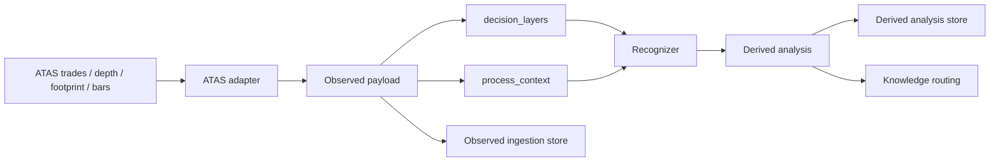

# Process-Aware Multi-Time-Cycle Architecture

See also [`market_script_driven_architecture.md`](market_script_driven_architecture.md) for the higher-level doctrine that organizes environment, key zones, live reaction, and support or resistance context into one market-script model.
See also [`fabio_system_absorption_checklist.md`](fabio_system_absorption_checklist.md) for the dedicated checklist that extracts Fabio-style auction, location, aggression, acceptance, and risk logic into system doctrine.
See also [`shuyin_gap_fill_system_absorption_checklist.md`](shuyin_gap_fill_system_absorption_checklist.md) for the dedicated checklist that turns index-futures gap fill and opening-auction logic into system doctrine.
See also [`atas_required_fields_checklist.md`](atas_required_fields_checklist.md) for the concrete collector-facing field list that maps these ideas into ATAS ingestion requirements.
See also [`atas_adapter_payload_contract.md`](atas_adapter_payload_contract.md) for the formal adapter-facing message contract and example payload shapes.
See also [`replay_workbench_architecture.md`](replay_workbench_architecture.md) for the standalone replay UI, event-overlay, strategy-library, and AI-briefing architecture.

## Goal

Build a market structure system that can preserve both:

- static snapshot context across month, week, day, hour, and minute layers
- dynamic formation process across seconds, liquidity episodes, and cross-session sequences

The system should always separate `observed facts` from `derived interpretation`.

## Layer Model

### Observed layers

- `macro_context`
  - month / week / day
  - structural range, key liquidity references, value area, swing structure
- `intraday_bias`
  - last 3 days / 1h / 30m
  - session positioning, directional pressure, intraday context
- `setup_context`
  - 15m / 5m
  - setup location, local pullback depth, local imbalance
- `execution_context`
  - 1m / footprint / DOM
  - immediate order-flow and execution signals
- `process_context`
  - `session_windows`: Asia / Europe / U.S. session windows
  - `second_features`: 1-second heatmap and price-path aggregates
  - `liquidity_episodes`: measured defended or contested price bands
  - `initiative_drives`: aggressive-order pushes, consumption, and continuation
  - `measured_moves`: distance ladders such as x manipulation leg or x range amplitude
  - `manipulation_legs`: forcing legs that later anchor trap, extension, or distribution logic
  - `gap_references`: gap existence, partial repair, and acceptance or rejection inside the gap
  - `exertion_zones`: historical drive-origin levels plus revisit behavior
  - `cross_session_sequences`: multi-session build, hold, and release traces
- `depth_elastic_context`
  - `depth coverage state`: unavailable / bootstrap / live / interrupted
  - `significant large-order tracks`: only high-impact displayed liquidity
  - `3-day liquidity memory`: spoof, absorption, magnet, defended-level candidates

### Derived layers

- `macro_context` interpretations
- `intraday_bias` interpretations
- `setup_context` interpretations
- `execution_context` interpretations
- `process_context` interpretations
  - cross-session release candidate
  - persistent defended zone
  - process divergence between higher build and lower execution

## Data Flow

## Why The Process Layer Exists

Snapshot-only systems miss:

- how price traversed the bar
- whether liquidity was replenished or pulled
- whether a defended zone persisted across one session and released in another
- whether a 1-minute base is part of a larger cross-session build-up
- whether a large displayed order was pulled before execution or truly traded
- whether a historically significant order level still matters on revisit within the next few days
- whether an aggressive drive truly pushed the market or only consumed liquidity without continuation
- whether a prior drive-origin zone re-fired on revisit or instead trapped the earlier participant

The `process_context` layer exists to preserve these facts in a replayable form before strategy logic is added.

## Observed Objects

### `ObservedSecondFeature`

Stores second-level aggregates such as:

- price path inside the second
- trade count, volume, delta
- best bid/ask
- depth imbalance
- extra measured metrics like absorption score or sweep distance

### `ObservedLiquidityEpisode`

Stores measured interaction with a price band:

- zone bounds
- executed volume against the zone
- replenishment count
- pull count
- rejection distance

This is still observational. The system should not directly label it as accumulation or distribution at ingest time.

### `ObservedInitiativeDrive`

Stores measured aggressive-order exertion:

- aggressive volume and net delta
- number of consumed price levels
- travel distance versus counter-move
- continuation duration after the initial burst

This lets the downstream analysis reason about initiative, consumption, and momentum without needing the full raw stream every time.

### `ObservedMeasuredMove`

Stores measured expansion as a multiple of a known unit:

- x manipulation leg
- x range amplitude
- x opening range or other reference family
- highest body-confirmed threshold
- next ladder target

This object is designed for "how far has the campaign really pushed?" style review.

### `ObservedManipulationLeg`

Stores the forcing leg itself:

- displacement ticks
- primary and secondary objectives
- whether those objectives were reached
- optional related key zone

This object is intentionally separate from the later measured move so the system can preserve both the cause and the later extension.

### `ObservedGapReference`

Stores the gap and its repair history:

- gap low and high
- gap size in ticks
- first touch
- deepest repair so far
- fill ratio
- acceptance or rejection inside the gap

This lets the system answer both "is there still a gap?" and "how likely is the market to keep filling it?" without losing the original observed facts.

### `ObservedExertionZone`

Stores historically important origin zones created by prior drives:

- source drive id
- zone bounds
- establishing volume and delta
- revisit count
- successful and failed re-engagement count
- latest revisit delta and volume
- post-failure delta and follow-through

This object is designed for the "someone pushed from here before, will they push again, or are they trapped now?" style of context-building.

### `DerivedKeyLevelAssessment`

Turns exertion zones into trading context:

- current role: support, resistance, or pivot-like flip area
- current state: monitoring, defended, broken, or flipped
- strength score
- directional bias on interaction
- reasoning based on establishment, revisit, and post-break behavior

This is the main bridge from raw process evidence into AI-assisted support and resistance context.

### `DerivedGapAssessment`

Turns observed gap facts into script context:

- untouched / partial fill / fully filled
- unlikely / possible / probable / completed
- directional implication of the current interaction
- remaining ticks to a full repair

This is the bridge from raw gap observations into AI-assisted gap-fill context.

### `ObservedCrossSessionSequence`

Stores multi-session continuity:

- which sessions participated
- maintained zone
- start price and latest price
- linked episode ids, initiative-drive ids, exertion-zone ids, and event ids

This allows the system to later infer narratives like Europe build and U.S. release without losing the underlying evidence.

### `DepthSnapshotPayload`

Stores elastic depth coverage facts:

- current coverage state
- significant large-order tracks only
- best bid and ask reference
- track lifecycle status such as active, pulled, filled, or moved

This payload is intentionally sparse so the system does not need to store the full order book.

### `LiquidityMemoryRecord`

Stores only high-value depth memory for up to 3 days:

- significant order track summary
- derived classification such as spoof candidate or absorption candidate
- expiration time

This memory is designed for short-term manipulation and revisit behavior, not long-term historical DOM replay.

## Recommended Capture Strategy

- ATAS adapter emits event-level data and batch-posts to the local service.
- Local service aggregates second-level heatmaps and liquidity episodes.
- Local service also summarizes aggressive drives and maintains a short-lived memory of historically important exertion zones.
- Derived analysis converts exertion zones into explicit key-level assessments so later AI layers do not need to infer support and resistance from scratch each time.
- 5m / 10m structure snapshots remain useful, but they should coexist with raw and second-level process layers.
- Depth tracking is elastic: if DOM is unavailable the system degrades gracefully, and when DOM resumes it only tracks significant large orders plus their 3-day memory.

## Practical Next Step

After this contract layer, the next infrastructure milestone should be:

1. raw trades batch ingestion
2. raw depth batch ingestion
3. second-level feature builder
4. liquidity episode detector
5. cross-session sequence linker
