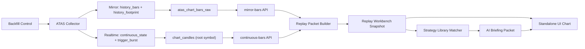

# Replay Workbench Architecture

## Goal

Build a standalone review UI that can:

- load a 3-7 day historical window from ATAS-oriented data,
- query raw mirrored contract bars without relying on the ATAS viewport,
- query continuous analysis bars separately from raw mirror bars,
- render event annotations and focus regions on top of that chart,
- attach strategy-library candidates,
- assemble a structured AI briefing from the event set,
- surface key support and resistance zones without interfering with live ATAS usage.

This workbench is a **review and context-compression tool**, not an execution terminal.

## Design Constraints

- Do not depend on screen scraping or ATAS chart pixels.
- Do not depend on the operator manually setting many per-chart parameters.
- Preserve the existing rule: separate observed facts from derived interpretation.
- Treat the UI as a consumer of structured replay packets, not as the source of market logic.
- Keep the UI isolated from the live ATAS workspace so replay and annotation do not affect trading screens.
- Only fetch from ATAS when the requested historical replay packet is missing locally.
- Limit replay verification to once per day.
- After 3 successful verification passes, keep the replay packet as durable cache until the operator manually invalidates it.

## Core Flow

## Current Runtime Architecture

The system now uses a dual-layer chart architecture:

- `atas_chart_bars_raw`
  - raw ATAS chart mirror
  - keyed by `chart_instance_id + contract_symbol + timeframe + started_at_utc`
  - preserves timezone-capture metadata and original bar time text
- `chart_candles`
  - continuous-analysis storage
  - keyed by `root_symbol + timeframe + started_at`
  - only native timeframe history is written directly
  - higher timeframes should be aggregated from reliable lower timeframes later

This separation prevents contract-specific mirror data from overwriting the continuous analysis layer.

## Recommended Split

### 1. Historical Window Acquisition

The replay UI should not read the current ATAS screen.

Historical acquisition should be cache-first:

- if the local replay packet already exists, reuse it,
- only fetch from ATAS when the packet is missing,
- verify stored packets at most once per day,
- after 3 successful verification passes, stop reacquiring automatically,
- require manual invalidation before any later reimport.

It should consume a structured historical window containing:

- reconstructed candles,
- raw mirror bars when contract-accurate view is required,
- event annotations,
- focus regions,
- strategy-library candidates,
- optional AI briefing instructions.

This packet is now represented by:

- [ReplayWorkbenchSnapshotPayload](D:/docker/atas-market-structure/src/atas_market_structure/models.py)

The packet now carries explicit cache policy and verification state so the UI and later AI review can distinguish:

- fresh ATAS acquisition,
- local cache reuse,
- unverified cache,
- verified cache,
- durable locked cache,
- manually invalidated cache.

### 2. Standalone Chart Reconstruction

The workbench chart should be rebuilt locally from the replay packet.

Minimum render layers:

- candle layer,
- event marker layer,
- focus region layer,
- optional reference levels,
- optional summary sidebar.

This gives two benefits:

- ATAS remains dedicated to live order-flow work,
- the workbench can annotate aggressively without cluttering the trading chart.

### 3. Event Layer

Events should remain structured and explicit.

Minimum event classes for the workbench:

- collector events,
- strategy-library matched events,
- manual review events,
- AI review events.

Examples:

- same-price replenishment,
- initiative drive,
- gap first touch,
- upper-liquidity harvest,
- post-harvest reversal watch,
- Europe defended bid,
- failed overhead capping.

### 4. Focus Region Layer

Focus regions are not the same as raw events.

They are operator-facing highlighted zones derived from multiple events and context.

A focus region should answer:

- where the operator should look first,
- why that price zone matters,
- which events justify the region,
- whether the current script is continuation, reversal, or unresolved.

### 5. Strategy Library Attachment

The workbench should not send raw events directly to AI without context.

It should first attach strategy-library candidates that explain:

- which stored pattern(s) are relevant,
- which observed events matched them,
- why those patterns matter now.

This reduces AI ambiguity and keeps the prompt tied to the local doctrine library.

### 6. AI Briefing Packet

The AI should receive a compact structured packet, not an unbounded chart dump.

Minimum sections:

- replay window,
- event annotations,
- focus regions,
- strategy-library candidates,
- explicit operator objective,
- required output sections.

Expected AI output:

- key zones,
- support and resistance ranking,
- continuation vs reversal scripts,
- invalidations,
- unresolved conflicts.

## Why This Is Better Than Reusing ATAS UI

- The ATAS chart stays optimized for live reading and execution.
- The replay UI can add dense labels and region overlays without harming the trading workspace.
- The workbench can mix multiple days of context, strategy-library notes, and AI results in one view.
- The same replay packet can be reused for review, journaling, and later model training.

## Current Infrastructure Added

The backend now has a dedicated storage contract and endpoint for replay packets:

- `POST /api/v1/workbench/replay-snapshots`
- `POST /api/v1/workbench/replay-builder/build`
- `GET /api/v1/workbench/replay-cache?cache_key=...`
- `POST /api/v1/workbench/replay-cache/invalidate`

Relevant files:

- [workbench_services.py](D:/docker/atas-market-structure/src/atas_market_structure/workbench_services.py)
- [models.py](D:/docker/atas-market-structure/src/atas_market_structure/models.py)
- [repository.py](D:/docker/atas-market-structure/src/atas_market_structure/repository.py)
- [replay_workbench.snapshot.sample.json](D:/docker/atas-market-structure/samples/replay_workbench.snapshot.sample.json)

Additional runtime APIs:

- `GET /api/v1/chart/mirror-bars`
- `GET /api/v1/chart/continuous-bars`
- `GET /api/v1/adapter/backfill-command`
- `POST /api/v1/adapter/backfill-ack`

## Next Implementation Steps

1. Add contract-roll logic on top of the continuous layer instead of treating root-symbol candles as already fully rolled.
2. Aggregate higher timeframes from reliable lower-timeframe continuous data instead of writing synthetic fanout during history ingestion.
3. Add footprint-aware replay packet rebuild so raw mirror bars and footprint chunks can be stitched into one review packet.
4. Extend replay verification to compare requested backfill ranges with actual mirror coverage before rebuilding.
