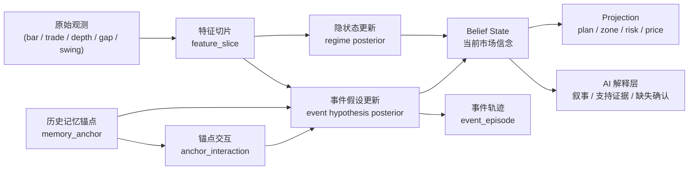

# Replay Workbench 分层市场隐状态与事件记忆模型

> 状态：v0.1 草案
>
> 目标：把 Replay Workbench 的“事件识别”升级为“市场隐状态推断 + 事件假设跟踪 + 历史记忆锚点 + 在线概率更新”的统一模型。

---

## 0. 相关文档

建议与以下文档配合阅读：

1. `docs/replay_workbench_ui_ai_design.md`
   - 右侧工作台、AI 会话、图表协作、标记管理的 UI 设计
2. `docs/replay_workbench_ui_ai_schema_draft.md`
   - 现有 Session / Message / PlanCard / Annotation / Memory 的对象草案
3. `docs/replay_workbench_event_strategy_gap_remediation_plan.md`
   - 当前事件提取、事件候选、上图/转计划链路的补齐方案
4. `docs/analysis_pipeline.md`
   - 当前三层分析编排、轻量监控、深分析的现状与边界
5. `docs/replay_workbench_event_model/replay_workbench_event_reasoning_playbook.md`
   - 面向未来 AI / 工程师的事件推理、交易理念、术语与使用手册
6. `docs/replay_workbench_event_model/replay_workbench_event_trading_training_checklist.md`
   - 面向当前阶段交易者的训练清单、复盘模板与分周执行计划
7. `docs/replay_workbench_event_model/replay_workbench_tradable_event_templates.md`
   - 当前已整理的可交易事件标准模板

本文档的定位不是替代上述文档，而是补上它们目前缺失的一层：

`市场处于什么隐藏状态、正在形成什么事件、过去的结构记忆如何改变未来概率`

---

## 1. 为什么要引入这套模型

当前系统中“事件”主要还是一种静态输出：

- 某个价位
- 某个区域
- 某个风险提醒
- 某个计划结论

但真实市场中的关键问题不是“现在识别到什么标签”，而是：

1. 当前市场到底处于什么运行模式
2. 这个模式是否正在衰竭、加速、平衡、过渡
3. 当前正在形成的几个事件假设分别有多大概率
4. 随着 K 线和微结构继续推进，这些概率如何变化
5. 过去的累积中心、震荡中心、缺口、启动点，如何持续影响后面的事件概率

因此，系统不能只做：

`当前片段 -> 单个事件标签`

而要做：

`观测 -> 隐状态后验 -> 事件假设后验 -> 历史锚点修正 -> 当前叙事输出`

---

## 2. 设计目标

本模型要同时满足以下目标：

1. 支持实时研判
   - 每个时间步都能更新当前市场隐状态与事件假设
2. 支持历史脉络回放
   - 历史分析不是只看终局，而是看当时如何一步一步演化
3. 支持路径依赖
   - 过去的累积中心、平衡中心、缺口、启动点要能持续影响未来
4. 支持多假设并行
   - 不能过早只保留一个结论
5. 支持可解释性
   - 必须说清当前判断为什么变化，还缺什么确认
6. 支持与现有 UI 兼容
   - `plan / zone / risk / price` 仍可作为投影层输出，但不再承担底层认知模型角色

---

## 3. 核心结论

### 3.1 事件不是标签，而是轨迹

事件要表达的不是“是什么”，而是：

- 从哪里开始形成
- 形成到了哪个阶段
- 更可能走向哪边
- 为什么这次概率上升或下降

### 3.2 市场不是无记忆的

过去的：

- 累积中心
- 震荡中轴
- 缺口边缘
- 启动点
- 高成交接受区
- trapped inventory 区域

都应该以“记忆锚点”的形式保留下来，参与未来事件概率更新。

### 3.3 当前 UI 中的对象属于投影层

当前常见的：

- `plan`
- `zone`
- `risk`
- `price`

仍然有价值，但它们更适合被视为：

`底层隐状态 / 事件假设 / 记忆锚点 的用户可操作投影`

而不是底层建模本身。

---

## 4. 模型总览



---

## 5. 分层对象模型

本模型建议至少引入 8 类核心对象。

## 5.1 Observation：观测层

这是最底层，只存事实，不下结论。

典型观测包括：

- K 线收盘
- trade tick
- delta / imbalance
- absorption trigger
- large-order cluster
- gap create / gap fill
- swing high / swing low confirm
- liquidity shift

它回答的问题是：

`发生了什么`

建议原则：

- append-only
- 不直接写主观结论
- 保留 `market_time`
- 保留 `ingested_at`
- 保留 schema version

---

## 5.2 FeatureSlice：特征切片层

这是对观测层的窗口化加工结果。

它不是事件，也不是结论，而是用于状态更新的数值描述。

典型字段：

- `range`
- `body_ratio`
- `wick_ratio`
- `overlap_ratio`
- `trend_efficiency`
- `impulse_strength`
- `compression_score`
- `expansion_score`
- `initiative_buy_score`
- `initiative_sell_score`
- `absorption_score`
- `gap_fill_progress`
- `new_high_success_rate`
- `new_low_success_rate`
- `time_in_balance`

它回答的问题是：

`这一小段行情的结构特征是什么`

---

## 5.3 HiddenRegime：隐市场状态层

这一层表示市场当前处于什么运行机制。

建议初版采用以下 6 个 regime：

1. `strong_momentum_trend`
2. `weak_momentum_trend_narrow`
3. `weak_momentum_trend_wide`
4. `balance_mean_reversion`
5. `compression`
6. `transition_exhaustion`

这些 regime 不是事件，它们是大背景。

例如：

- `strong_momentum_trend`
  - 延续先验高
  - 原地形成真正反转的先验低
- `compression`
  - 突破或假突破概率提高
- `transition_exhaustion`
  - 反转、假反转、再延续都需要并行跟踪

它回答的问题是：

`市场当前更像什么运行模式`

---

## 5.4 EventHypothesis：事件假设层

这层不是单选，而是多假设并行。

建议初版先支持以下事件假设：

1. `continuation_base`
2. `absorption_accumulation`
3. `profit_taking_pause`
4. `reversal_preparation`
5. `breakout_acceptance`
6. `breakout_rejection`
7. `failed_reversal`
8. `distribution_balance`

每个事件假设都必须有：

- `kind`
- `phase`
- `probability`
- `supporting_evidence`
- `missing_confirmation`
- `invalidating_signals`

推荐 `phase`：

- `emerging`
- `building`
- `confirming`
- `weakening`
- `resolved`
- `invalidated`

它回答的问题是：

`现在更可能正在形成什么`

---

## 5.5 MemoryAnchor：记忆锚点层

这是本文档最关键的一层。

市场不是无记忆的，过去事件结束后并不会完全消失，而会留下影响未来的结构锚点。

建议初版支持以下 anchor 类型：

1. `balance_center`
2. `accumulation_center`
3. `distribution_center`
4. `gap_edge`
5. `initiative_origin`
6. `high_volume_acceptance_zone`
7. `trapped_inventory_zone`
8. `failed_breakout_reference`

一个锚点不是单功能标签，而是多角色对象。例如一个旧累积中心可能同时具备：

- 吸引力
- 止盈目标意义
- 阻力/支撑属性
- 测试点意义
- 反转观察意义

因此建议锚点存多角色画像，而不是单一 `type=resistance`。

示例：

```json
{
  "anchor_id": "anc_21520_balance_01",
  "anchor_type": "balance_center",
  "price_center": 21520.5,
  "price_low": 21516.0,
  "price_high": 21525.0,
  "origin_event_id": "evt_accum_001",
  "strength": 0.82,
  "freshness": 0.77,
  "touch_count": 1,
  "state": "active",
  "role_profile": {
    "magnet": 0.74,
    "take_profit_target": 0.58,
    "reversal_reference": 0.42,
    "resistance_from_below": 0.61,
    "support_from_above": 0.55
  }
}
```

它回答的问题是：

`过去留下了什么，它现在为什么还重要`

---

## 5.6 AnchorInteraction：锚点交互层

当价格重新接近历史锚点时，系统不应该简单说“历史事件回来了”，而应该记录一次新的交互。

例如：

- 回访旧累积中心
- 测试旧平衡区中轴
- 接近缺口边缘
- 回踩启动点
- 再次触碰 trapped inventory 区域

这类对象建议单独记录为：

- `approach_balance_center`
- `revisit_accumulation_center`
- `test_gap_edge`
- `retest_initiative_origin`

它回答的问题是：

`当前价格正在如何与过去的结构记忆发生关系`

---

## 5.7 EventEpisode：事件轨迹层

`EventHypothesis` 是每个时间步的后验分布，`EventEpisode` 是一段已经形成的轨迹。

示例：

- 一段强动能下跌
- 一段 20 分钟吸收累积
- 一段均值回归平衡
- 一段假突破失败

它建议包含：

- `episode_id`
- `kind`
- `phase`
- `start_time`
- `end_time`
- `peak_prob`
- `dominant_regime`
- `resolution`
- `key_evidence_summary`

它回答的问题是：

`这段行情最终被系统看成了什么脉络`

---

## 5.8 BeliefState：当前市场信念层

这是系统在任一时刻对市场的“当前理解快照”。

示例：

```json
{
  "market_time": "2026-03-22T09:41:00Z",
  "regime_probs": {
    "strong_momentum_trend": 0.18,
    "weak_momentum_trend_narrow": 0.21,
    "balance_mean_reversion": 0.12,
    "compression": 0.17,
    "transition_exhaustion": 0.32
  },
  "event_hypotheses": [
    {
      "kind": "absorption_accumulation",
      "phase": "building",
      "prob": 0.31
    },
    {
      "kind": "continuation_base",
      "phase": "building",
      "prob": 0.46
    },
    {
      "kind": "reversal_preparation",
      "phase": "emerging",
      "prob": 0.23
    }
  ],
  "active_anchors": [
    {
      "anchor_id": "anc_21520_balance_01",
      "anchor_type": "balance_center",
      "distance_ticks": 6,
      "influence": 0.27
    }
  ],
  "transition_watch": [
    "fill_last_bear_gap",
    "bull_initiative_cluster",
    "fail_to_make_new_low"
  ]
}
```

它回答的问题是：

`系统此刻最相信什么`

---

## 6. 这套模型与 HMM 的关系

这套模型确实有明显的 HMM 味道，但不等于标准 HMM。

像 HMM 的部分：

- 存在隐藏状态
- 隐藏状态只能由观测推断
- 状态会随时间转移
- 每个时间步都需要更新后验概率

与标准 HMM 的主要区别：

1. 需要更长记忆
   - 过去的累积中心、缺口、启动点会长期影响未来
2. 需要分层状态
   - 上层是 regime，下层是事件假设
3. 需要半马尔可夫特性
   - 状态持续时长本身很重要
4. 需要显式锚点
   - 历史结构不能只被隐式遗忘

因此，更准确的说法是：

`分层隐状态模型 + 显式记忆锚点 + 在线概率过滤`

---

## 7. 更新机制

## 7.1 更新节奏

每来一个新的时间步，系统执行一次更新。

时间步可以按不同粒度触发：

- 每根 K 线
- 每 30 秒窗口
- 每次关键微结构触发
- 每次 gap / swing / absorption 状态变化

---

## 7.2 基本更新链路

1. 读取新增观测
2. 更新 `feature_slice`
3. 更新 `regime posterior`
4. 激活附近 `memory_anchor`
5. 生成或更新 `anchor_interaction`
6. 更新 `event_hypothesis posterior`
7. 写入 `belief_state projection`
8. 若达到阈值，更新或闭合 `event_episode`

---

## 7.3 工程版概率更新公式

初版不要求严格的贝叶斯闭式推导，可以先用工程可解释版本：

```text
score(h, t) =
  regime_prior(h, t)
  + local_feature_score(h, t)
  + anchor_influence_score(h, t)
  + path_dependency_score(h, t)
  + transition_bonus_or_penalty(h, t)
```

然后对多个假设做归一化：

```text
prob(h, t) = softmax(score(h, t))
```

其中：

- `regime_prior`
  - 由当前 regime 分布决定的先验
- `local_feature_score`
  - 当前窗口的结构特征贡献
- `anchor_influence_score`
  - 附近历史锚点对当前假设的增强或抑制
- `path_dependency_score`
  - 结合近几段轨迹的路径依赖修正
- `transition_bonus_or_penalty`
  - 某些状态切换本身是否合理

---

## 7.4 概率必须绑定目标和时间窗

系统中的概率不能写成模糊的“反转概率”。

必须绑定：

- 目标事件
- 时间窗
- 成立标准

例如：

- `P(未来10根K线内开始补最近空头缺口)`
- `P(当前吸收最终演化为延续底座而非反转)`
- `P(未来20分钟维持均值回归而不是重新单边加速)`

否则概率会失去可回测性。

---

## 8. 前一个事件如何增强后一个事件

系统不建议直接写成：

`事件A -> 事件B`

而建议表达为：

`事件A -> 生成锚点M -> 当前价格与M发生交互 -> 当前事件B的先验被修正`

这有几个好处：

1. 兼容历史事件结束后的长期影响
2. 兼容同一锚点有多种角色
3. 兼容“过去结构记忆”与“当前局部证据”共同作用
4. 便于审计为何当前判断被抬高或压低

示例：

- 一段旧累积生成 `accumulation_center`
- 当前价格回到这个中心附近
- 系统创建 `anchor_interaction`
- 该 interaction 同时：
  - 提高 `reversal_preparation` 的先验
  - 提高 `mean_reversion_to_center` 的先验
  - 也可能提高 `target_reached_then_reject` 的先验

最终不是单结论，而是多个假设一起变化。

---

## 8.1 事件交易原则：我们交易的是“事件是否成立”

本模型默认采纳以下交易理念：

**交易的对象不是价格本身，而是事件是否成立、是否延续、是否被否决。**

这意味着系统不应只输出：

- 看涨 / 看跌
- 顶 / 底
- 这里像要反转

而应输出：

1. 当前主事件假设是什么
2. 该事件要成立，接下来应出现哪些证据
3. 这些证据应在什么时间窗内出现
4. 如果没有出现，应该如何降级或放弃该事件
5. 如果出现了更强的新事件，旧事件如何被接管

### 8.1.1 交易流程不是“猜方向”，而是“跟踪剧本”

推荐的交易动作是：

1. `Hypothesize`
   - 提出当前最可能的事件剧本
2. `Validate`
   - 定义该剧本成立应出现的证据
3. `Engage`
   - 只有在事件开始兑现时介入
4. `Switch`
   - 若事件未兑现或被更强事件否决，则退出或切换

### 8.1.2 任何可交易事件都必须包含 4 个要素

每个 `EventHypothesis` 不应只有名称和概率，还必须有：

1. `initial_hypothesis`
   - 当前认为市场正在形成什么事件
2. `validation_rules`
   - 该事件成立所需的后续证据
3. `invalidation_rules`
   - 该事件被否决的条件
4. `time_window`
   - 这些证据必须在多久之内出现

示例：

```json
{
  "hypothesis": "momentum_continuation",
  "prob": 0.63,
  "time_window": "next_30m",
  "expected_next_signals": [
    "fresh_initiative_push",
    "shallow_pullback_hold",
    "no_deep_return_into_balance"
  ],
  "invalidation_rules": [
    "no_fresh_push_within_30m",
    "return_to_old_balance_center",
    "opposite_initiative_displacement"
  ],
  "replacement_events": [
    "balance_formation",
    "failed_continuation",
    "reversal_preparation"
  ]
}
```

### 8.1.3 退出条件不只是亏损，而是“事件已经不在”

系统必须支持两类不同的退出原因：

#### A. 事件未兑现

例如：

- 认为当前是动能延续
- 但合理时间窗内没有出现新的 initiative
- 没有重新夺回位移效率
- 行情反而拖入平衡或压缩

这时即使价格没有明显反向，也应降低该事件置信度，必要时退出。

#### B. 事件被新事件接管

例如：

- 原本在做均值回归
- 结果突然出现更强的单边位移与流动性撤退
- 原有回归剧本被新的单边推进事件覆盖

这时退出并不是“情绪化止损”，而是：

`旧事件被新事件否决，新叙事接管市场`

### 8.1.4 交易系统必须允许“待确认”

系统不应强制每个时刻都给出：

- 必涨
- 必跌
- 必反转

很多时候更合理的输出是：

- 正在形成，但尚未确认
- 旧事件衰减中，新事件尚未完全接管
- 当前只适合观察，不适合参与

因此，`low confidence / pending confirmation / transitional` 不是系统缺陷，而是必要输出。

---

## 8.2 市场机制分类：不要按术语学派建模

本模型建议：

**不要按 SMC / ICT / 盘口术语堆出一套大词典，而要优先按市场机制归类。**

不同学派只是不同观察语言，它们背后指向的底层真实过程并没有那么多种。

### 8.2.1 建议的底层机制事件

建议第一版 canonical 机制事件优先收敛到以下 8 类：

1. `initiative_displacement`
   - 一方用主动单推动明显位移
2. `passive_absorption`
   - 主动攻击被被动流动性持续消化
3. `liquidity_withdrawal`
   - 某侧流动性撤退，价格穿越阻力/支撑变容易
4. `acceptance`
   - 价格进入新区域后被市场接受
5. `rejection`
   - 价格测试某区域后迅速离开
6. `exhaustion`
   - 原主导方向仍在，但效率持续下降
7. `liquidity_sweep_trap`
   - 扫高/扫低后触发陷阱或状态切换
8. `inventory_transfer_transition`
   - 控制权和库存正在从一方转向另一方

### 8.2.2 学派术语应作为别名而非主 schema

例如：

- `ICT: displacement`
- `SMC: BOS / CHOCH`
- `ICT: FVG`
- `SMC: order_block`
- `Auction: acceptance / rejection`

这些应保留为：

- `alias_tags`
- `narrative_labels`

而不是直接成为数据库主事件类型。

这样可以避免模型被某个学派的术语边界绑死。

---

## 8.3 DOM / Heatmap / Order Flow 的角色：机制证据层

`Price Action`、`Tape`、`DOM`、`Heatmap`、`SMC/ICT` 在系统中承担的角色不同。

### 8.3.1 推荐的职责划分

- `Price Action`
  - 结果层
  - 看大背景、结构、节奏
- `Order Flow / Tape`
  - 执行层
  - 看谁真的在打、打完以后价格是否有效位移
- `DOM`
  - 瞬时近场层
  - 看当前队列、防守、撤退、穿越难易度
- `Heatmap`
  - 持续兴趣层
  - 看流动性是否持续存在、是否迁移
- `SMC / ICT`
  - 叙事层
  - 适合解释与表达，不适合直接做数据库主分类

### 8.3.2 DOM 不负责直接给方向，它负责告诉你“这个位置怎么反应”

DOM 更适合回答：

- 这里是不是有真实防守
- 防守是稳定的还是会撤
- 打过去到底难不难
- 是被动吸收还是轻松穿越
- 当前是在测试、卡住，还是马上要穿

因此在本模型里，DOM 最适合被压缩为“机制证据”，而不是直接变成大量事件标签。

### 8.3.3 推荐的 DOM 证据桶

建议把原始 DOM / Heatmap 信息压缩进少数中间证据桶：

1. `dom_defense_evidence`
2. `dom_withdrawal_evidence`
3. `dom_refresh_absorption_evidence`
4. `dom_vacuum_evidence`
5. `dom_migration_evidence`
6. `dom_failure_evidence`

这些证据桶再去更新：

- `regime`
- `event hypothesis`
- `anchor interaction`

而不是直接拥有几十个独立决策权重。

### 8.3.4 DOM 与历史锚点必须结合

DOM 的最佳用途不是脱离背景做主结论，而是在关键位置上验证：

- 历史锚点是否真的在起作用
- 这是测试、接受、拒绝，还是轻松穿越
- 旧中心是否还具有防守、吸引或止盈意义

因此更合理的顺序是：

`先定结构和历史锚点，再用 DOM 看当前机制细节`

---

## 9. 数据存储建议

建议至少拆成以下 8 张表。

## 9.1 `raw_market_event`

原子事实流。

字段建议：

- `event_id`
- `symbol`
- `event_kind`
- `event_payload`
- `market_time`
- `ingested_at`
- `source`
- `schema_version`

建议：

- append-only
- 不做主观判别

---

## 9.2 `feature_slice`

窗口特征表。

字段建议：

- `slice_id`
- `symbol`
- `timeframe`
- `window_start`
- `window_end`
- `feature_payload`
- `market_time`

特点：

- 宽表或 JSON 混合存储
- 支撑回放与离线评估

---

## 9.3 `regime_state_update`

隐状态更新日志。

字段建议：

- `update_id`
- `symbol`
- `market_time`
- `asof_time`
- `top_regime`
- `regime_probs_json`
- `reason_codes_json`

注意：

- 必须同时保留 `market_time` 与 `asof_time`
- 避免后验知识污染历史时点判断

---

## 9.4 `memory_anchor`

历史锚点主表。

字段建议：

- `anchor_id`
- `symbol`
- `anchor_type`
- `price_center`
- `price_low`
- `price_high`
- `origin_event_id`
- `strength`
- `freshness`
- `touch_count`
- `state`
- `role_profile_json`
- `created_at`
- `updated_at`

---

## 9.5 `anchor_interaction`

价格与历史锚点的交互日志。

字段建议：

- `interaction_id`
- `anchor_id`
- `symbol`
- `market_time`
- `approach_direction`
- `distance_ticks`
- `approach_speed`
- `regime_snapshot_json`
- `reaction_type`
- `reaction_strength`
- `reason_codes_json`

---

## 9.6 `event_hypothesis_update`

每个假设在每个时点的后验更新。

字段建议：

- `update_id`
- `symbol`
- `market_time`
- `asof_time`
- `hypothesis_kind`
- `phase`
- `prior_prob`
- `posterior_prob`
- `delta`
- `supporting_evidence_json`
- `missing_confirmation_json`
- `invalidating_signals_json`

---

## 9.7 `event_episode`

已形成的一段事件轨迹。

字段建议：

- `episode_id`
- `symbol`
- `kind`
- `phase`
- `start_time`
- `end_time`
- `peak_prob`
- `dominant_regime`
- `resolution`
- `summary`

---

## 9.8 `belief_state_projection`

给 UI 与 AI 解释层直接读取的当前态快照。

字段建议：

- `symbol`
- `market_time`
- `top_regime`
- `regime_probs_json`
- `top_hypotheses_json`
- `active_anchors_json`
- `transition_watch_json`
- `updated_at`

作用：

- 避免 UI 每次从 changelog 全量回放
- 支持工作台快速查询与刷新

---

## 10. 技术处理链建议

如果从行业常见做法抽象，本模型适合采用以下链路：

1. 原子事件流
2. 特征切片
3. 状态流更新
4. 当前态投影
5. 离线湖仓沉淀

对应到本项目可理解为：

- `raw_market_event`
- `feature_slice`
- `regime_state_update / event_hypothesis_update`
- `belief_state_projection`
- 可选的离线标签与评估表

---

## 11. 与当前 Replay Workbench 的关系

## 11.1 不替代现有 Annotation / PlanCard

现有：

- `ChatAnnotation`
- `ChatPlanCard`
- `reply extraction`
- `plan / zone / risk / price`

仍然保留。

但在新模型中，它们的角色变为：

`用户可操作的投影层`

即：

- `HiddenRegime`
- `EventHypothesis`
- `MemoryAnchor`
- `AnchorInteraction`

经过筛选和解释后，投影为用户能确认和操作的对象。

---

## 11.2 当前 UI 右侧事件整理应升级为“脉络面板”

不应只显示：

- 一个事件名称
- 一个风险条目
- 一个价位区间

而应显示：

1. 当前主 Regime
2. 当前 Top 3 事件假设
3. 各自阶段与概率
4. 最近一次概率变化原因
5. 当前激活的历史锚点
6. 还缺哪些确认
7. 哪些信号会使当前假设失效

---

## 12. AI 在系统中的职责

初版不建议让 AI 直接承担底层状态推断与概率计算。

更合理的职责边界是：

### 规则/特征引擎负责

- feature 计算
- regime score
- anchor activation
- hypothesis score
- transition update

### AI 负责

- 把当前 belief state 翻译成人话
- 总结支持证据与缺失确认
- 解释为什么概率变化
- 生成复盘叙事
- 辅助候选上图与转计划卡

一句话概括：

`机器算状态，AI 讲故事`

---

## 13. 分阶段落地建议

## Phase 1：最小隐状态模型

目标：

- 固定 6 个 regime
- 固定 6~8 个事件假设
- 用规则打分做在线更新

完成标准：

- 能在历史回放中看到 regime 与 hypothesis 概率变化

---

## Phase 2：记忆锚点模型

目标：

- 引入 `memory_anchor`
- 引入 `anchor_interaction`
- 让旧累积中心、缺口、启动点参与先验修正

完成标准：

- 系统能解释“为什么旧中心会增强当前反转/止盈/阻力概率”

---

## Phase 3：工作台投影与 UI

目标：

- belief state 投影到 Replay Workbench
- 右侧事件整理升级为“脉络面板”
- `plan / zone / risk / price` 变为投影结果而非底层模型

完成标准：

- 用户看到的是“当前主线、概率变化、确认条件、历史锚点”

---

## Phase 4：离线校准与 AI 解释层

目标：

- 为不同假设补 `outcome_label`
- 离线评估与校准概率
- 引入 AI 解释层做叙事输出

完成标准：

- 系统既能在线研判，也能离线复盘和纠错

---

## 14. 如何避免特征爆炸与参数过拟合

这是本模型必须明确写进设计文档的硬约束。

如果系统演化成：

- 特征越来越多
- 参数越来越多
- 每个特征都有独立权重
- 最终直接对收益做拟合

那么它会迅速掉进量化系统常见的问题：

- 历史解释力很强
- 样本外稳定性很差
- regime 切换后迅速失效
- 人很难理解为什么会这样判断

因此，本模型必须坚持：

`观测可以丰富，但状态空间必须稀疏，参数自由度必须受约束`

### 14.1 核心原则

建议用以下五条原则约束模型容量：

1. `小状态空间，大观测空间`
   - 可以观察很多东西，但最终只投影到少量稳定 regime 与 hypothesis
2. `特征是证据，不是自由参数入口`
   - 原始特征先归入少数证据桶，不直接拥有独立决策权
3. `先建模状态，再讨论收益`
   - 先判断市场运行机制、阶段与转移，不直接拟合收益结果
4. `分层门控，不做单一大模型`
   - 先定 regime，再只激活该 regime 下相关的少数事件假设
5. `可解释优先于堆指标`
   - 任何新增特征都必须能回答“它改善了哪一个稳定中间变量”

### 14.2 不允许做成“参数动物园”

以下做法必须明确避免：

- 每增加一个新观测，就发明一个新事件类别
- 每增加一个特征，就增加一个独立可调权重
- 把几十个细碎特征直接堆成一个总分
- 直接把最终目标设成收益最大化
- 历史效果不好解释时，继续增加更多特征“补救”

这类模式非常容易形成“历史上什么都能解释，实时里什么都不稳定”。

### 14.3 推荐的容量控制结构

建议强制采用：

`多观测 -> 少数证据桶 -> 少数隐状态 -> 少数事件假设 -> 用户投影`

例如：

原始观测可以很多：

- K 线实体与影线
- 波动压缩与扩张
- overlap
- gap
- delta
- absorption
- large-order clustering
- acceptance / rejection
- anchor distance
- revisit speed

但这些观测不要直接进入最终判断，而是先汇总到少数中间证据桶：

- `impulse_evidence`
- `balance_evidence`
- `compression_evidence`
- `exhaustion_evidence`
- `initiative_evidence`
- `anchor_response_evidence`

再由这些证据桶更新有限状态：

- 6 个左右的 regime
- 6~8 个左右的事件假设
- 少数核心锚点类型

### 14.4 对系统的硬约束

建议把以下约束视为第一版系统的固定边界：

1. `regime` 类别数固定，不轻易增加
2. `event hypothesis` 初版不超过 8 类
3. 新特征必须映射到已有证据桶，不能直接进入最终层
4. 不允许每个特征拥有独立交易权重
5. 低置信状态必须允许输出“待确认”，不能强行单结论
6. 先优化状态识别稳定性，再讨论收益优化
7. 所有新增特征都必须支持删减实验

### 14.5 如何使用 AI 而不放大过拟合

AI 可以帮助我们理解更复杂的上下文，但不应直接变成一个无限自由度的黑箱决策器。

推荐职责边界：

- 规则/特征引擎负责：
  - 提取特征
  - 聚合证据桶
  - 更新隐状态与事件假设
- AI 负责：
  - 解释当前 belief state
  - 说明为何概率变化
  - 总结支持证据与缺失确认
  - 帮助人工复盘与修正规则

一句话概括：

`AI 用来压缩与解释上下文，不用来无限放大参数自由度`

### 14.6 评估原则

这个系统的第一评估目标，不应该是“收益最高”，而应该是：

1. 状态识别是否稳定
2. hypothesis 概率是否随上下文合理变化
3. 锚点是否真的提升了可解释性
4. 历史回放时是否避免明显 hindsight bias
5. 新特征加入后，样本外稳定性是否真的改善

收益评估仍然重要，但应放在第二层：

- 先验证结构建模是否稳
- 再验证这种结构建模是否改善交易决策

### 14.7 一句话原则

这套模型要坚持的不是“少看数据”，而是：

**多看事实，少设自由度。**

---

## 15. 当前已明确的开放问题

以下问题留待后续迭代补充：

1. regime 的最小稳定集合是否是 6 类，还是需要拆得更细
2. 事件假设的第一版全集应如何选取，避免一开始类别爆炸
3. 锚点的失效与消耗规则应如何定义
4. 哪些概率目标最值得先纳入回测
5. 多时间框架如何共享或叠加 belief state
6. `plan / zone / risk / price` 投影层如何与底层 hypothesis 进行一对多映射
7. SQLite / ClickHouse / 内存状态各自承载哪些表最合适

---

## 16. 一句话定义

Replay Workbench 的下一代事件系统，不应再是“文本里抽几个事件标签”，而应是：

**一个分层市场隐状态与事件记忆模型：用观测更新隐状态，用历史锚点修正事件先验，用在线概率跟踪市场脉络，再把结果投影成用户可操作的计划、区域、风险与价位。**

