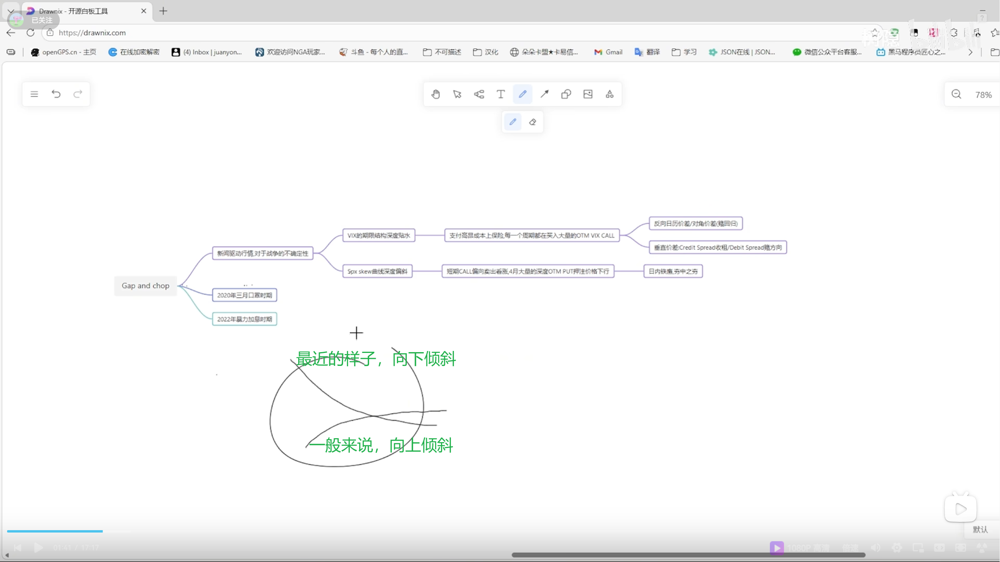

最近因为观察这个期权结构对最近行情引发的思考
大概我就写在这里
最近的行情是什么呢
我把它总结为GAP&chop就是电子盘巨大缺口
然后它不像以前就是GAP FIll那种结构
它美盘不会去填补反而在某一个价位附近不停的chop
我觉得为什么呢
主要是因为最近的行情都是新闻在驱动
战争的不确定性
大家都不知道仗什么时候打完
这个时候非常像什么
你可以去
你可以等我说完这些去回看一下就是20年的口罩的时期和22年
暴力加息的时期
这个原因它会导致这个期权结构
尤其是VIX和标普的结构
第一是它的期权结构
期限结构深度的贴水
就是近月和远月深度贴水
第二是什么
SKL曲线它深度的偏斜
如果我画出来
画画在哪里
正常来说
由于时间的不确定性
对吧
因为你不知道后面会发生什么样的事情
所以说对于VIX它的期权
它一般的期限结构是这样子

但是最近发生的深度贴水
导致它的期限结构变成了这样
然后BELP的SKL曲线
正常来说
大概就是这样
它是像一个微笑曲线

但最近是什么样子(深度偏斜)

我不会在这里解释任何这种基础的问题
就是能看懂的话就看
看不懂就算了
我只是单纯把我自己的想法录下来
这并不是一个教学
这并不是一个教学视频
只是我的一个记录视频
这个的它的来由在哪里呢
在这里

你可以去看看BADCHART
你看这是VIX它的近月
比如我们看3月25号
你去看它的VI
然后IV

然后看它的这些比较虚直期权的
未平仓的数量

然后再去看看它远月的
比如说这是4月15号的
可以看到它的IV
它处在一个贴水的状态
然后如果你去看标普
这个是3月20号
去看它的那些虚直期权以及它的IV
还有它的仓位
这个是4月的
然后再叠加一个什么呢
就是VIX它是标普未来30日的波动型
然后还有一个V VIX
就是它对于VIX这个指数的波动型
现在的V VIX是多少呢
是125
这个什么概念
这个时候要打开
我们可以先观察一下

它的正常的区间在哪里呢
在日本央行加息之前
我看什么时候
大概是24年的8月
24年8月之前
它的一个正常区间
应该是在80到100
然后变化是从什么时候发生的
首先是8月央行加息
央行加息有大量套保的资金流出
然后之后又叠加了一个
好像是什么数据
我忘了CPI还是什么
就业率反正大幅不及预期
然后再加上日经好像8月5号吧
还是8月几号
直接直接跌停
然后从那之后VIX的区间
再叠加一个24年当时
后面我看大概11月吧
11月穿着要准备上台
从那之后
这个区间就从80到100变成了
90到110
整整上升了大概10个级点
甚至是90到120
你可以看到这里明显的
明显的区别

就是大家对于波动率的波动率
这个预期在它的风值和风股
在放大
125是个什么概念
处于一个极高位
这会导致什么
这会导致每天都会因为这种
战争行情的不确定性
去买入非常高昂的保险
因为你每天都要买入大量的
大量的
价外的VIX的CALL
因为你怕它战争什么时候不结束
或者是突然打个导弹什么的
对吧
然后VIX疯狂的标准
你需要去买虚值的CALL
然后你还要干嘛呢
你还要去
去买大量的就是远月到期的
标普的虚值的PUT
因为你不能
许多大资金
它不能够去赌单边
它必须要去买保险
万一如果说标普
真的什么
打仗又重 战火重燃了
对吧
然后邪恶川普
要统一世界来干嘛的
它必须要有虚值put
它去兜住它的底
因为它手上持有大量的
现货股票
它需要去做一个对冲的保护
但是由于这个高
V VIX
它会导致一个什么现象呢
就是这一部分的成本极高
因为IV非常的高
你像做市商
他会说可以
我可以替你兜这个底
对吧
因为你要撮合交易
你做市商愿意去接你的订单
但是因为这个IV极高
所以你需要付出
非常非常高昂的成本
这个就导致了一个什么现象
导致了
现在对于VIX它的期权
大量的期权是
在做一个反向的日内价差
就是说
我去买这个
我去买近月的CALL
但是卖出远月的PuT
还有就是对角价差
去赌这个回归
就去赌
往后往后一个月之后VIX价格
因为它不会永远在高位
对吧

你看到它永远会在一个峰值
然后下来会
正常都会在一个区间
一个更窄的区间里波动
还有就是一部分的垂直价差
这个我实在是不知道用汉语
去怎么翻译
感觉怎么翻译都很奇怪
就是credit spread收租
就是去执行一个收租的策略
因为这个权力金非常高
所以我每天就去卖这个期权
然后去收租
还有就是debit Spread
我去赌一个方向
去赌它
继续往上
这个其实应该放在
放在这里
这一部分应该放在这里
就是它垂直价差
它既可以在VIX
去卖高iv的PUT
然后它再去买入一个
更深虚值的PUT
去兜底做一个垂直价差
要么就是在标普里面
对吧
如果你想要去赌它的方向
但是你不可能去
如果你觉得价格
因为在高VIX的趋势下
你觉得标普会低
但是你不可能去裸PUT
这个时候你会干嘛呢
你会去买
就是更远月到期
比如说4月到期的PUT
然后你的保险是什么呢
你去卖一张
更深虚值的PUT
这个时候如果价格跌下去
你卖的更深虚值的PUT
因为它的IV
它就可以抵消掉你买
你买更高价格PUT的
成本
这个时候不管
你就去掉了IV的风险
因为不管IV涨还是跌
你的单子
不会受到波动率的影响
你可以纯粹去
赚这个方向的利润
然后到这里
由于这些

还有一个就是日内铁鹰
这个太变态了
你就看一看
最近
这个
这个标普
日内铁鹰
有多变态
就是当然这个
这种ETH涨和美盘横盘
就是GAP and chop
这个原因我会在后面再
再去说出我的看法
但是你可以去看看
就是这些
从大概从
2月2月什么时候开始
日内铁鹰策略
它的胜率有多高
你可以去自己
自己去复判一下
反正非常的夸张
他就在赌价格
价格虽然会大幅的跳空
但是价格不会击穿put wall
永远会有人在那里兜底
他永远在那个区间内收租
这个
这个我可以挪一个非常经典的一天
我可以挪到
3月16号这一天
你可以看看
你可以看这一天
从开盘开始

是干嘛呢
就是货利盘
前一天的货利盘
和那个因为跳空导致的
平仓盘
他在对轰
疯狂对轰中
然后这个时候价格在涨对不对

然后到了10点这个时候开始
各种那个价差和铁鹰策略就开始入场
你可以看到这上面下面
然后对通压力疯狂的下行对吧

但是价格价格下不去
价格下不去
铁鹰疯狂铁鹰无限铁鹰
无限赚钱
无限印钞
最后收敛这一部分
然后结束
所以说由于以上的种种
这些策略和VVIX
他到了125
以及这种战争行情的影响
他就会导致什么呢
导致大量的行情
会在ETH走完
大量的行情在ETH走完
然后到达了
RTH的时候
我也不停地chop

他跌不下去
但是也长不上去
因为你可以
你通过这个期权结构
你就可以想象到
在当天是什么样的
就是每到了新的一天
美盘开盘
首先蜂拥而至的是什么
是大量的
因为隔夜跳空
这个gap导致的
导致的那种散户也好
什么也好的爆仓
这里有大量的卖盘去平仓
就会导致在现货里
会有大量的多单去买入
但是同时
就像我说的那种魔法对轰
前一天的
当这些人卖put平仓的时候
他买回这些put
这个时候
在微观层面
本来因为长期的下行
他的gamma是负的
每天都会处在一个负gamma的环境里
但是他的delta是净多头

这个时候在更微观的层面
这种净多头的敞口他会消失
做市商需要去买入现货去平掉昨天的美盘拿来防守的空单，然后出现空头回补

但是这种魔法对轰持续半个小时到1个小时，之后因为当日IV会回落，因为不确定性消失了。最恐惧的是电子票这种跳空，这部分的深度虚值的put它会萎缩
它一萎缩下去
它就不需要那么多空单去对冲
所以说又开始去买现货
但是这个时候你要明白
对于vix的担忧
这个时候还会有大量的近月的vix的call和标普深度的虚值put在买入
所以又会到一部分
它补不掉这个gap
它就会再横盘横盘横盘就无限
这个时候的欺权结构会是什么样的
就每天一开始
先是大量的vixcall会买入
会赌这个
因为你vixcall在涨
其实就差不多就这个说法不代表准

就差不多可以等价于标普会阴跌或者下跌
然后同时大量的标普的虚值put被买入
比如说这是虚值
然后这是实值
然后还有大量的铁鹰
然后大量的蝴蝶
然后和大量的一些看跌价差
平值的put会在这种地方
会在这种地方
然后这种地方
然后因为有铁鹰会在这种地方
你可以看到这些价格集中在什么点呢
集中在虚值的部分
和平值的部分

但是中间的流动性是没有的
但是由于价格就不能集穿
每天每天美盘我就在看put我
每天都在put我上反复横跳

但是不能集穿那个墙
所以导致在宏观上它处于一个附的伽马节
但是在微观上它是正伽马
所以这就是为什么
就是每天电子盘走自大面
然后美盘开始横盘
这种状态我觉得可能还要持续到至少4月
反正蛮可怕的
挺恶心的
因为它只有在当前价格附近
和大量的虚值
有大量的订单
但是在其他价格
它的流动性是没有的
而这些价格又去不了
然后也不能集穿put wall
就无限
chop
你直到收盘
快到收盘末尾的时候
又会留下一地的保险
从第二天周而复始的开始
反正这就是我对于目前行情的一些思考
如果是对于期货交易来说
可能更多的要去考虑一个
剥头皮
不能去赌打啊的方向
如果大的方向如果有的话
一般都会在eth去产生
而不会在RTH去产生
这就是我的一部分理解
